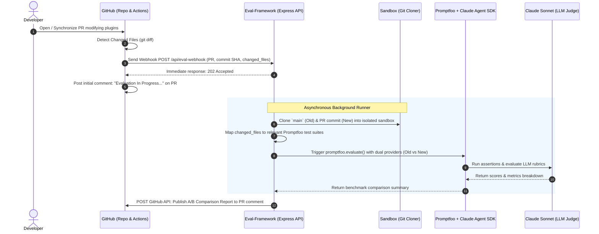

# Eval-Framework: Automated AI Evaluation Pipeline

> Automated evaluation, benchmarking, and regression testing service for Claude Code Plugins using **Promptfoo**, **Claude Agent SDK**, and **GitHub Actions**.

---

## 📌 Overview

**Eval-Framework** is a specialized backend evaluation service designed to automate testing, benchmarking, and regression detection for AI agents, skills, commands, and plugins within the **Claude Code Marketplace** ecosystem.

Whenever a developer opens or updates a Pull Request that modifies plugin definitions (prompts, markdown instructions, skills, or sub-agents), this framework:
1. Receives an HTTP Webhook event from GitHub Actions.
2. Clones two isolated versions into a sandbox:
   - **Old Version**: Baseline branch (e.g., `main`).
   - **New Version**: Target PR branch / commit.
3. Maps modified files to their corresponding Promptfoo test suites.
4. Executes side-by-side A/B benchmark evaluations using **Claude Agent SDK** and an LLM Judge (Claude Sonnet).
5. Formats a comprehensive comparison report (Score diffs, Pass/Fail rates, Latency, Cost, Named Score Rubrics) and posts it directly back as a comment on the GitHub PR.

---

## 🏗️ Architecture & Workflow



---

## 📁 Repository Structure

```text
Eval-Framework/
├── .env                                # Environment variables (GITHUB_TOKEN, PROMPTFOO_UI_URL)
├── package.json                        # Project dependencies (Express, Promptfoo, Claude Agent SDK)
├── promptfooconfig.yaml                # Standalone / sample Promptfoo configuration
├── plugins-sanbox/                     # Isolated sandbox containing cloned repo versions per run
├── working-dir/                        # Working execution directory for Claude Agent SDK
└── src/
    ├── app.js                          # Express server, API endpoints & webhook listener
    ├── evals/                          # Evaluation configurations and testcases
    │   ├── promptfoo.js                # Core runner: invokes promptfoo.evaluate()
    │   ├── promptfooConfig.js          # Provider definitions, Judge model & SDK options
    │   ├── code-review/                # Evaluation suites for code-review plugins
    │   │   └── cpp-review/
    │   │       └── testcases/
    │   │           └── cpp-review-testcases.yaml
    │   └── doc-review/                 # Evaluation suites for doc-review plugins
    │       ├── audit-api-doc/
    │       │   └── testcases/
    │       ├── doc-lint/
    │       │   └── testcases/
    │       └── review-doc/
    │           ├── fixtures/           # Sample input documents (poor PRDs, architecture specs)
    │           ├── prompts/            # Prompt templates
    │           └── testcases/          # Testcase assertions and rubric scoring rules
    └── utils/
        ├── common.js                   # Git multi-version cloner, provider composition
        ├── evalSuiteMap.js             # Catalog mapping suite names to testcase paths
        ├── filterMap.js                # File-to-testcase mapping for changed plugin files
        └── githubUtil.js               # Report formatter & GitHub REST API PR commenter
```

---

## ⚙️ Setup & Configuration

### 1. Prerequisites
- **Node.js**: Version `>= 18.x`
- **Git**: Installed and available in system `PATH`
- **GitHub Personal Access Token**: Token with `repo` or `pull-requests: write` permissions

### 2. Install Dependencies
```bash
git clone https://github.com/trungbb7/Eval-Framework.git
cd Eval-Framework
npm install
```

### 3. Environment Variables (`.env`)
Create or edit `.env` in the root directory:

```env
# GitHub Token used to post evaluation comments on Pull Requests
GITHUB_TOKEN=ghp_yourPersonalAccessTokenHere

# URL to the Promptfoo Web UI (Local or Cloudflare Tunnel)
PROMPTFOO_UI_URL=http://localhost:15500
```

---

## 🚀 Running the Application

### Start the Server
```bash
npm run dev
```
The server listens by default at `http://localhost:3000`.

### Open Promptfoo Web UI (Optional)
To inspect historical benchmark results visually in the browser:
```bash
npx promptfoo view
```

---

## 📡 API Reference

### 1. GitHub Actions Webhook
- **Endpoint**: `POST /api/eval-webhook`
- **Description**: Receives pull request events from GitHub workflows, triggers background evaluation, and responds immediately with `202 Accepted`.
- **Sample Payload**:
  ```json
  {
    "event": "pull_request",
    "action": "synchronize",
    "pr_number": 12,
    "commit_sha": "a1b2c3d4e5f6",
    "repository": "trungbb7/demo-claude-marketplace",
    "ref": "feature/update-review-doc",
    "changed_files": [
      "plugins/doc-review/commands/review-doc.md"
    ]
  }
  ```

### 2. Manual Evaluation Trigger
- **Endpoint**: `POST /api/evaluate`
- **Description**: Manually trigger an evaluation run specifying target repository, custom versions, and selected suites or files.
- **Sample Payload**:
  ```json
  {
    "repository": "trungbb7/demo-claude-marketplace",
    "old_version": { "ref": "main" },
    "new_version": { "commit_sha": "a1b2c3d4e5f6" },
    "eval_suites": ["review-doc", "audit-api-doc"],
    "pr_number": 12
  }
  ```

### 3. List Available Suites
- **Endpoint**: `GET /api/suites`
- **Description**: Returns all registered evaluation suites and their testcase file paths.
- **Sample Response**:
  ```json
  {
    "suites": [
      { "name": "cpp-review", "testcasePath": "code-review/cpp-review/testcases/cpp-review-testcases.yaml" },
      { "name": "audit-api-doc", "testcasePath": "doc-review/audit-api-doc/testcases/audit-api-doc-testcases.yaml" },
      { "name": "doc-lint", "testcasePath": "doc-review/doc-lint/testcases/doc-lint-testcases.yaml" },
      { "name": "review-doc", "testcasePath": "doc-review/review-doc/testcases/review-doc-testcases.yaml" }
    ]
  }
  ```

---

## 📊 Sample Pull Request Evaluation Report

Upon evaluation completion, the bot posts an A/B benchmark breakdown comment directly on the PR:

```markdown
## Evaluation Report for `a1b2c3d`

### Overall Comparison

| Metric | Old Version | New Version |
|--------|:-----------:|:-----------:|
| Score | 0.75 | 0.92 _(+0.17)_ |
| Tests Passed | 3 | 4 |
| Tests Failed | 1 | 0 |
| Assertions Passed | 12 | 15 |
| Assertions Failed | 2 | 0 |
| Latency | 8.4s | 7.9s |
| Cost | $0.0340 | $0.0321 |

### Named Score Breakdown

| Criterion | Old Version | New Version |
|-----------|:-----------:|:-----------:|
| 🟢 ScoreProvided | 1.00 | 1.00 |
| 🟢 AmbiguityDetected | 0.50 | 1.00 |
| 🟢 ComprehensiveReview | 0.80 | 0.95 |
| 🟢 ArchitectureAudit | 0.70 | 0.90 |

> 🟢 New version performs **at least as well** as the baseline.

[View full results](https://promptfoo-ui.example.com/eval/xxx)
```

---

## 🛠️ Adding New Evaluation Suites

1. Create a new testcase directory under `src/evals/<plugin-name>/<feature-name>/`.
2. Define a YAML testcase file specifying `description`, `vars`, and `assert` blocks (`icontains`, `llm-rubric`, metric labels).
3. Register the suite identifier and file path in [evalSuiteMap.js](file:///d:/Workspace/test/Eval-Framework/src/utils/evalSuiteMap.js).
4. Map affected plugin files in [filterMap.js](file:///d:/Workspace/test/Eval-Framework/src/utils/filterMap.js) to trigger automated tests whenever relevant files change.
